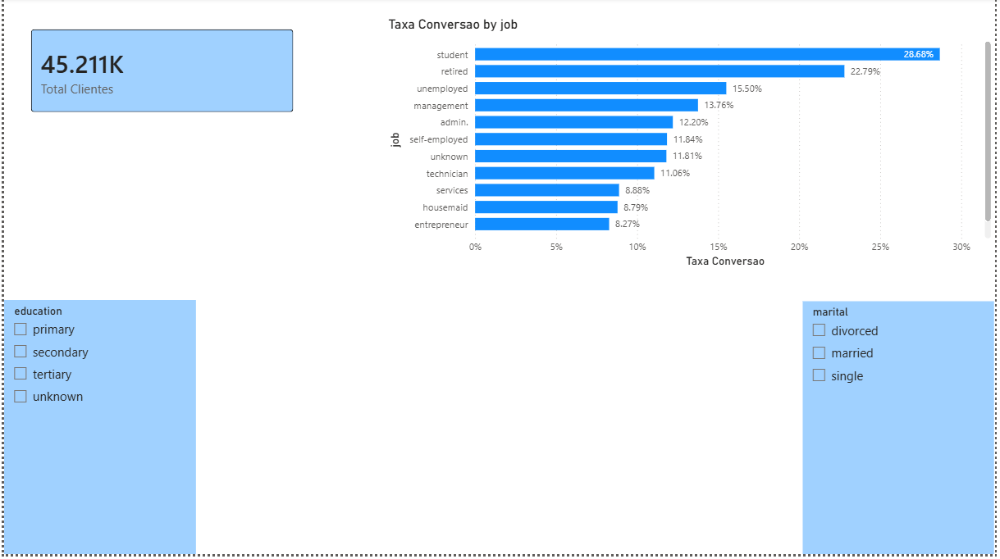
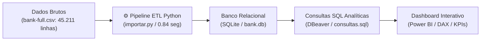
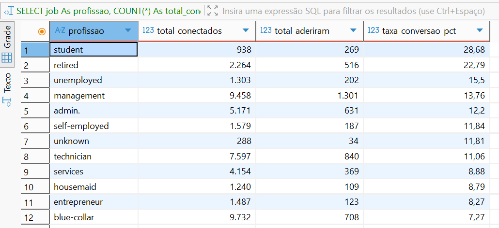
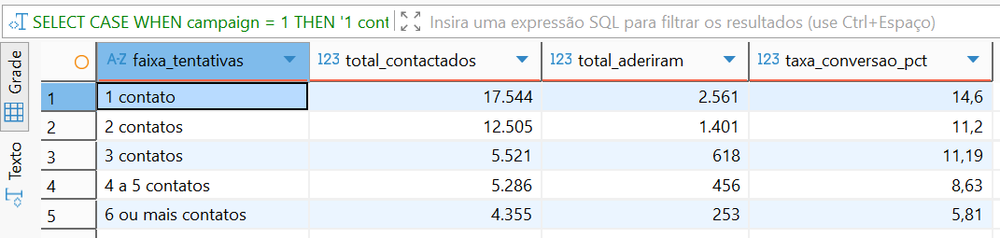
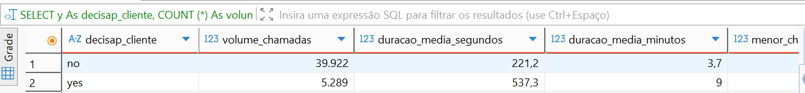
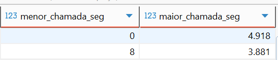
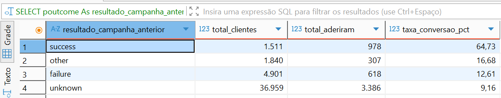
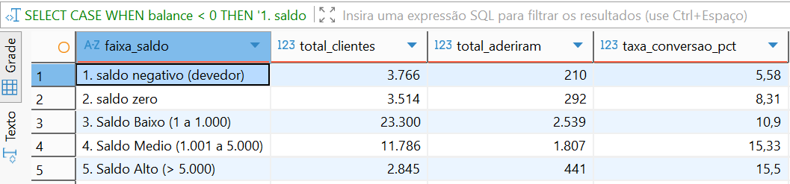

# 📊 Bank Marketing Analytics: Otimização de Conversão e Inteligência Operacional

[](https://python.org)
[](https://sqlite.org)
[](https://powerbi.microsoft.com)
[](#)

Projeto end-to-end de **Análise de Dados e Business Intelligence** aplicado a uma campanha real de telemarketing bancário com **45.211 clientes** (UCI Machine Learning Repository). 

O projeto abrange todo o ciclo analítico: desde a ingestão e tratamento de dados brutos via **Python (ETL)**, modelagem e queries de negócio no **SQLite/DBeaver**, até a construção de métricas em **DAX** e um **Dashboard Executivo interativo no Power BI**.

---

##  Visão Geral do Dashboard Executivo



> **Interatividade do Painel:** Filtros dinâmicos por escolaridade (`education`) e estado civil (`marital`), recalculando em tempo real o volume de clientes e a taxa percentual de adesão por categoria profissional.

---

##  O Problema de Negócio

Uma instituição financeira realizou uma campanha massiva de telemarketing com mais de **45.000 ligações** para venda de depósitos a prazo fixo (*term deposits*). 

Apesar do elevado investimento e desgaste da equipe de operadores, a **taxa de conversão geral estagnou em 11,70%**. A diretoria necessitava responder:
1. **Onde está o vazamento de recursos?** Quais perfis consomem tempo de chamada sem gerar retorno?
2. **Quantas tentativas de contato são ideais** antes que a insistência se torne prejuízo operacional?
3. **Qual é o tempo de atendimento ideal** que separa uma venda concluída de uma recusa?
4. **Quais nichos prioritários** devem compor a lista de ligações das próximas campanhas?

---

##  Arquitetura da Solução (Pipeline de Dados)



---

##  Principais Descobertas & Insights de Negócio

### 1. Desperdício com Operários vs. Oportunidade em Estudantes e Reformados
* A equipe direcionou o maior esforço para **operários (`blue-collar`)**, com **9.732 ligações**, obtendo a **pior conversão da empresa: apenas 7,27%**.
* Em contrapartida, **estudantes (`student`)** e **aposentados/reformados (`retired`)** apresentaram taxas extraordinárias de **28,68%** e **22,79%** (mais que o dobro da média geral de 11,7%).

* **Ação Recomendada:** Redirecionar 40% das escalas de telemarketing para produtos sob medida para estudantes e aposentados.

### 2. A "Regra dos 3 Contatos" (Fadiga Operacional)
* **1ª ligação:** 14,60% de conversão.
* **2ª a 3ª ligação:** ~11,20% de conversão.
* **4ª a 5ª ligação:** 8,63% de conversão.
* **6 ou mais ligações:** **5,81%** de conversão.

* **Ação Recomendada:** Estabelecer uma trava operacional rígida no CRM: **máximo de 3 tentativas por cliente**. Ligar 6 vezes queima horas de trabalho e derruba o ROI da operação pela metade.

### 3. A Duração da Chamada como Indicador Forte de Venda
* Chamadas com recusa (`no`) duram em média **3,7 minutos** (221 segundos).
* Chamadas com sucesso (`yes`) duram em média **9,0 minutos** (537 segundos) — quase **2,5x mais tempo**.


* **Ação Recomendada:** Eliminar metas de "número excessivo de chamadas rápidas por hora" para operadores. Vender produtos financeiros exige criar confiança e tirar dúvidas técnicas.

### 4. O Valor do Histórico Anterior (`poutcome`)
* Clientes que já haviam fechado contrato no passado (`poutcome = 'success'`) converteram em impressionantes **64,73%**!

* **Ação Recomendada:** Criar uma lista VIP de recompra priorizada no início de cada mês fiscal.

### 5. Saldo Bancário como Pré-Filtro
* Clientes com saldo negativo / devedores (`balance < 0`) convertem apenas **5,58%**.
* Clientes com saldo acima de 1.000 euros convertem **15,33% a 15,50%** (quase 3x mais).

* **Ação Recomendada:** Aplicar filtro prévio no sistema para não ofertar produtos de poupança/depósito a contas com saldo devedor.

---

##  Tecnologias e Ferramentas Utilizadas

| Ferramenta / Tecnologia | Finalidade no Projeto |
| :--- | :--- |
| **Python 3** (`csv`, `sqlite3`, `time`) | Script automatizado de extração, tratamento e carregamento em lote (*batch insert*). |
| **SQLite & DBeaver** | Banco de dados relacional e execução das 6 queries analíticas com agregações e `CASE WHEN`. |
| **Power BI Desktop** | Modelagem dimensional, criação de visuais (Cards, Gráficos de Barras, Slicers). |
| **Linguagem DAX** | Cálculos de medidas dinâmicas (`COUNTROWS`, `CALCULATE`, `DIVIDE`). |

---

## 📁 Estrutura de Arquivos do Repositório

```text
bank-marketing-analytics/
├── bank-full.csv                 # Dataset original com 45.211 registros (UCI)
├── importar.py                   # Script de ETL em Python (leitura e gravação no SQL)
├── consultas.sql                 # Coleção de 6 queries SQL analíticas documentadas
├── Dashboard_Marketing_Bancario.pbix # Arquivo executável do Power BI
├── dashboard_preview.png         # Imagem de demonstração do painel visual
└── README.md                     # Documentação executiva do projeto
```

---

##  Como Executar o Projeto Localmente

### 1. Clonar o repositório e preparar o ambiente:
```bash
git clone https://github.com/ExpertOsorio/bank-marketing-analytics.git
cd bank-marketing-analytics
```

### 2. Executar a importação do banco de dados (ETL):
```bash
python importar.py
```
*(Criará o arquivo `bank.db` com as 45.211 linhas inseridas em frações de segundo).*

### 3. Rodar as consultas no DBeaver:
* Conecte o **DBeaver** ao arquivo `bank.db` (Driver SQLite) e abra o arquivo `consultas.sql`.

### 4. Abrir o Dashboard no Power BI:
* Abra o arquivo `Dashboard_Marketing_Bancario.pbix` no **Power BI Desktop** para explorar os gráficos interativos.

---

##  Autor

Desenvolvido por **Osório Júnior**  
*Data Analyst & Business Intelligence*  
[GitHub](https://github.com/ExpertOsorio) |  [Email](mailto:osoriojrchambule@gmail.com) |  [LinkedIn](https://www.linkedin.com/in/os%C3%B3rio-j%C3%BAnior-1a4175317/)

